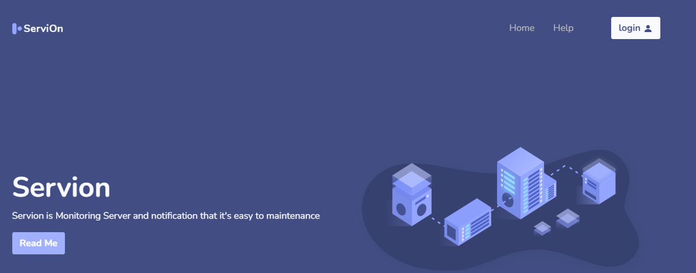

[](https://github.com/digitalocean/nginxconfig.io/stargazers)
[](https://github.com/iServion/iservion/blob/master/LICENSE)
<br />
[](https://github.com/iServion/iservion/issues?q=is%3Aissue+is%3Aclosed)
[](https://github.com/iServion/iservion/pulls?q=is%3Apr+is%3Aclosed)
[](https://github.com/iServion/iservion/issues)
[](https://github.com/iServion/iservion/pulls)

[](http//monitoring.injani.com)

<h3 align="center">⚙️ Servion 💉</h3>
<p align="center">
    The only tool you'll ever need to configure your  own server.
    <br />
    <a href="http//monitoring.injani.com"><strong>http//monitoring.injani.com »</strong></a>
    <br />
    <br />
    <a href="https://github.com/iServion/iservion/issues/new?template=report-a-bug.md">Report a bug</a>
    ·
    <a href="https://github.com/iServion/iservion/issues/new?template=request-a-feature.md">Request a feature</a>
</p>

<br />


## ▶️ Quick Start

1. Clone the repository
    ```sh
    git clone https://github.com/iServion/iservion.git
    ```

2. Install NPM packages
    ```sh
    npm install
    ```


3. Open .env file then edit with your own postgresql database
    ```sh
    DRIVER='postgres'
    PGUSER='postgres'
    PGHOST='localhost'
    PGDATABASE='your_database'
    PGPASSWORD='your_password'
    ```

3. Run the development server *(with file watchers)*
    ```sh
    npm run dev
    ```

4. Open the development site **[localhost:3000](http://localhost:3000)**
* Username: admin@admin.com
* Password: 123456


5. Lint your code *(eslint & stylelint)*
    ```sh
    npm test
    ```

6. Build for production *(using pm2 module)*
    ```sh
    npm i -g pm2
    pm2 start ecosystem.comfig.js --env production
    ```

We have a prebuilt admin dashboard that you can use to configure and manage your store find it here: [Monitoring Server](http://monitoring.injani.com)


### Original version

**Andhie Fitria &lt;andif@injani.com&gt; (https://injani.com)**
* GitHub: [sintret](https://github.com/sintret)
* LinkedIn: [sintret](https://www.linkedin.com/in/sintret/)

## 🤝 Contributing

Contributions are what make the open source community such an amazing place to be learn, inspire, and create.
Any contributions you make are **greatly appreciated**.

1. Fork the Project
2. Create your Feature Branch (`git checkout -b feature/AmazingFeature`)
3. Commit your Changes (`git commit -m 'Add some AmazingFeature'`)
4. Push to the Branch (`git push origin feature/AmazingFeature`)
5. Open a Pull Request

## ⚒️ Built With

* [EJS.js](https://ejs.org/) - Template handling & app generation
* [Prism](https://prismjs.com/) - Bash & NGINX syntax highlighting

## 📚 Resources

* [Express JS](https://expressjs.com/)
* [Postgresql for NodeJS](https://node-postgres.com/)
* [SSH for NodeJS](https://github.com/mscdex/ssh2)
* [Axios](https://github.com/axios/axios)

## ⭐️ Show your support

Give a ⭐️ if this project helped you!

## 📝 License

This project is licensed under the [MIT](https://github.com/iServion/iservion/blob/master/LICENSE) license.
